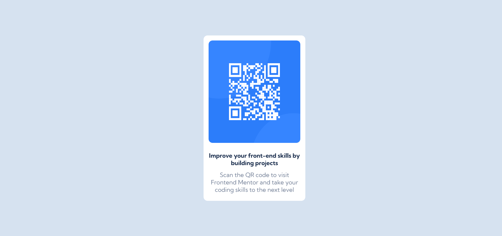

# Frontend Mentor - QR code component solution

This is a solution to the [QR code component challenge on Frontend Mentor](https://www.frontendmentor.io/challenges/qr-code-component-iux_sIO_H)

## Table of contents

- [Overview](#overview)
  - [Screenshot](#screenshot)
  - [Links](#links)
- [My process](#my-process)
  - [Built with](#built-with)
  - [What I learned](#what-i-learned)
  - [Continued development](#continued-development)
- [Author](#author)

## Overview

### Screenshot

### Links

- Solution URL: [Add solution URL here](https://your-solution-url.com)
- Live Site URL: [Add live site URL here](https://your-live-site-url.com)

## My process

### Built with

- Semantic HTML5 markup
- CSS custom properties
- Flexbox
- CSS
- webpage-first workflow

### What I learned

I learned better the use of relative lenghts in making a more responsive web page

### Continued development

I would love to focus more and improve on web responsiveness.

### Useful resources

## Author
- Frontend Mentor - [Frontend_mentor](https://www.frontendmentor.io/profile/activus-d)
- Twitter - [Twitter]https://twitter.com/activus_d)

